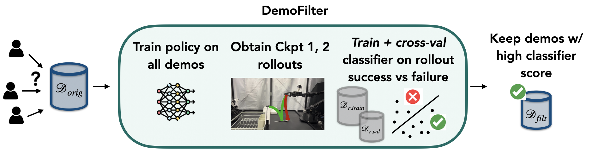

# Demo-SCORE: Automatic Online Robot Dataset Curation



**Abstract:** Many robot demonstration datasets contain heterogeneous demonstrations of varying quality. This heterogeneity may benefit policy pre-training, but can hinder robot performance when used with a final imitation learning objective. In particular, some strategies in the data may be less reliable than others or may be underrepresented in the data, leading to poor performance when such strategies are sampled at test time. Moreover, such unreliable or underrepresented strategies can be difficult even for people to discern, and sifting through demonstration datasets is time-consuming and costly. On the other hand, policy performance when trained on such demonstrations can reflect the reliability of different strategies. We thus propose for robots to self-curate based on online robot experience (Demo-SCORE). More specifically, we train and cross-validate a classifier to discern successful policy roll-outs from unsuccessful ones and use the classifier to filter heterogeneous demonstration datasets. Our experiments in simulation and the real world show that Demo-SCORE can effectively identify suboptimal demonstrations without manual curation. Notably, Demo-SCORE achieves over 15-35% higher absolute success rate in the resulting policy compared to the base policy trained with all original demonstrations.

**Project Page:** https://anniesch.github.io/demo-score/

**Paper Link:** https://arxiv.org/abs/2503.03707

# Installing

Due to the use of forks of multiple repos for different environments, several conda environments are necessary, though simple to set up.

## Demo-SCORE (+lerobot) environment

This environment can be used to run Demo-SCORE code and run code from the lerobot repo.
```
conda create -y -n demoscore python=3.10
conda activate demoscore
cd lerobot && pip install -e ".[aloha]"
cd ../demo_score && pip install -e .
pip install tensorboard
```

## Diffusion Policy and ALOHA ACT environments
These environments can each be set up by following the instructions within the READMEs within those repos. These instructions will assume those environments are called `robodiff` and `aloha`.

To train policies with these codebases, the `robodiff` and `aloha` should be used. The DemoSCORE classifier training and filtering code in `demo_score` can be added to these environments using `pip install -e .` in the `demo_score` directory. To do this, you may need to comment out imports from `lerobot` if you do not have it installed. The other option is to use a separate conda environment for steps where you use this code.


# Running Experiments with Demo-SCORE
 
Scripts with commands to run each step for each repo can be found in
```
diffusion_policy/experiments/example
``` 
and 
```
lerobot/experiments/example
```
Simply running these commands in sequence will run a full experiment with DemoSCORE. These script files also contain notes about arguments to use and hyperparameter configuration. `diffusion_policy/README.md`, `lerobot/README.md`, and `aloha_act/README.md` contain more instructions about how to configure policy training for each repo.


# Adding new environments/codebases

To make DemoSCORE compatible with a new codebase, slight modifications need to be made to the `demo_score` pip package to make it compatible with new dataset formats. Primarily, a new dataset format needs to be added to the `ClassifierDataset` classes in `demo_score/dataset.py`. You can see in this class how it currently handles a `format` keyword. Simply add code to handle another value of the `format` argument to this class and the `StepwiseClassifierDataset` subclass. Then, when using the classifier training script, be sure to change the `format` argument to that value. If using the sweep script, such as is demonstrated in `lerobot/experiments/example/step3_classifier_sweep.py`, you should change the `format` entry in the dictionary there. Then, make a new filtering script that simply loads each episode from a dataset one at a time and decides whether to keep it in the new dataset in `demo_score/demo_score/filter/`. You can see a simple (roughly 20 lines of code) example of this in `demo_score/demo_score/filter/classifier_filter_aloha.py` -- simply add a version of this script that works with your dataset format. Lastly, if you want to use the provided classifier sweep script, import this new filtering script's filtering function to `demo_score/demo_score/filter_sweep.py` the same way it is for the other dataset formats.

Note that the `robodiff` format was designed to work with that codebase but should work with other robomimic-style datasets.

# Documentation

## PI0 Model Integration

For information on integrating LeRobot PI0 models with Demo-SCORE, see:
- [PI0 Integration Guide (English)](./docs/pi0_integration_guide.md)
- [PI0 Integration Guide (Korean)](./docs/pi0_integration_guide_ko.md)

These guides explain how to adapt PI0 model embeddings for use with Demo-SCORE's dataset curation system.

# Forks

This repo contains forks of several other repos. These are:
- LeRobot: https://github.com/huggingface/lerobot
- ACT: https://github.com/tonyzhaozh/act
- Diffusion Policy: https://github.com/real-stanford/diffusion_policy
